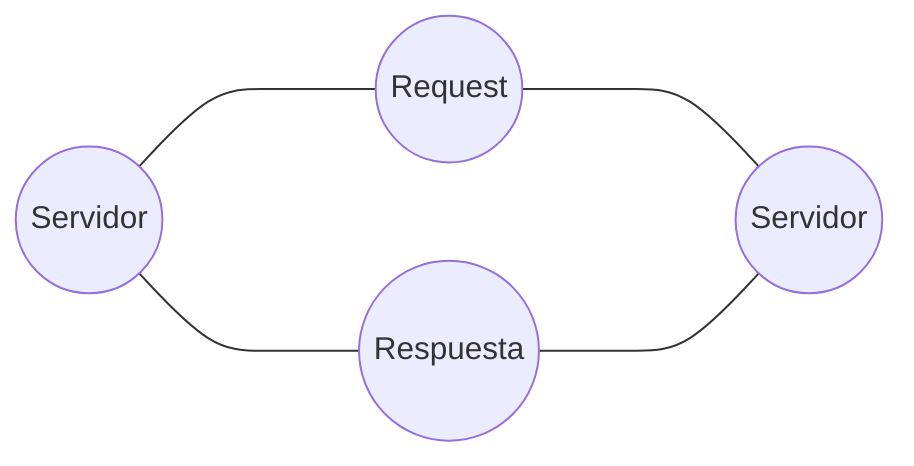

# Proyecto de Springboot

Este es un proyecto con springboot de una API REST para un usuario con telefono
el usuario contiene:
Nombre, email, password, Fecha de modificación, un telefono y un estado de si es activo o no.
Por otro lado el telefono, siendo un objecto independiente pero con una **relación uno es a uno** con el usuario contiene el numbero, el codigo de ciudad y el codigo de pais.
La aplicación fue desarrollada con postgresql para la base de datos, Hiberntate,  JPA , H2, etc.
## Inicialización y uso
Como la aplicación fue hecha en el framework Springboot de java y desarrollada en IntelliJ para una mejor productividad, se deberá correr el comando
```bash
./mvnw spring-boot:run
```
o si el usuario esta en windows
```bash
./mvnw.cmd spring-boot:run
```
Cabe destacar que la API Rest fue probada con Postman debido preferencias del desarrollador para su uso.

Esta aplicación también fue dockerizada por lo que para correrla en docker, ademas de tener la tecnología instalada, se deberán correr los comandos en la terminal

```bash
docker build -t apirest11
```
Luego insertar el comando:
```bash
docker run -p 8080:8080
```

y para comprobar que este corriendo:
```
docker ps
```
De ser necesario, para crear redes y escalar este servidor es posible usar el comando 
```
docker-compose up
```
## UML

La comunicación entre el servidor y la API Rest se genera de esta forma


